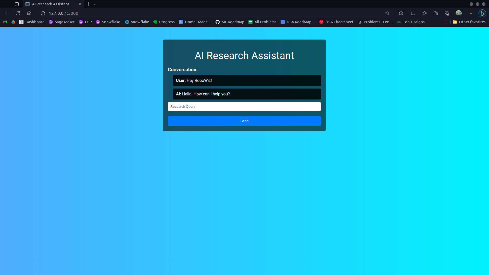

# LlamaResearchAsst
Real Time AI Research Chatbot Using Llama model

[Model Llama-2-7B, llama-2-7b-chat.ggmlv3.q4_1.bin](https://huggingface.co/TheBloke/Llama-2-7B-Chat-GGML)

[vector database](https://weaviate.io/)

[serpapi ](https://serpapi.com/search-api)

Download and place model in models directory

create .env file for storing API keys

